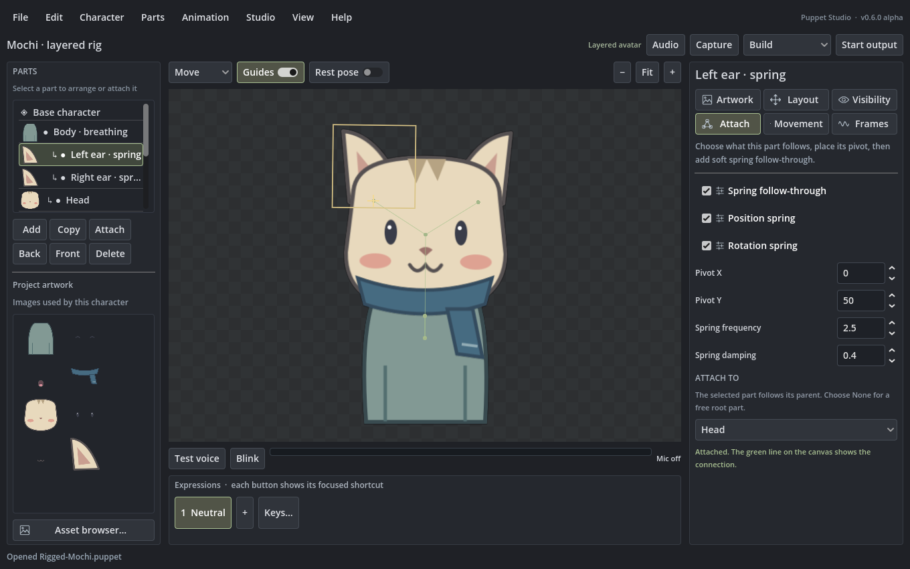

# Puppet Studio

Puppet Studio is a desktop editor and performer for image-based avatars. Build a character, connect it to your microphone, and capture the output in streaming software.



The current release is a Windows alpha. It runs as a normal portable application; Godot is already included in the executable.

## Download

Download the latest Windows ZIP from [Releases](https://github.com/Wabsa-kh/PuppetStudio/releases). Extract it, keep the three executable files together, and open `PuppetStudio.exe`.

## What works

- Quick four-image characters and separate-part layered characters
- Microphone-driven talking, automatic blinking, expressions, and costumes
- Per-expression focused and Windows background shortcuts, shown directly on the expression bar
- Parent attachments, editable pivots, springs, idle motion, speech bounce, and pointer follow
- Canvas tools for moving, rotating, scaling, and rigging parts
- A draggable pose timeline with saved-pose markers, easing, looping, and final-frame hold
- PNG, JPEG, WebP, GIF, APNG, and sprite-sheet artwork
- Per-part tint, opacity, mirroring, masks, and blend modes
- Visual artwork browser with thumbnails and native Windows file pickers
- Transparent, green-screen, magenta-screen, or custom-color output
- 20, 30, 60, and 120 fps capture modes
- Undo and redo, backups, recovery snapshots, and portable `.puppet` files
- Optional Windows background shortcuts and an authenticated local WebSocket API

## Make a character

Choose **File → New character** and pick a setup:

- **Quick avatar** uses idle, talking, blinking, and talking-while-blinking images.
- **Layered avatar** assembles separate body, head, eye, mouth, and accessory images, with attachments, movement, costumes, and saved-pose animation available when needed.

Every expression button shows its assigned key. Click **Keys…** beside the expression list to change the focused key, set an optional Windows background shortcut, and choose Select, Hold, Toggle, or Timed behavior.

The included Mochi project is a working example. Open it from **File → Open rig example** and try **Test voice**, **Blink**, the costume editor, and the motion editor.

## Capture

Click **Start output** to open the clean avatar window. Drag that window into position and capture it in OBS or similar software. Right-click it to return to the editor.

Application transparency passes the automated renderer test. OBS capture still needs testing across more Windows and GPU configurations, so the color-key backgrounds remain available as a fallback.

## Project status

Puppet Studio is useful today, but it is still an alpha. The current release does not include deformable meshes, rope rigs, PSD import, third-party project import, mouse/gamepad/MIDI bindings, or macOS and Linux packages. Live microphone behavior, OBS capture, global shortcuts in games, long sessions, and low-end hardware need wider real-world testing before a 1.0 release.

See [the roadmap](docs/FEATURE_ROADMAP.md), [validation results](docs/VALIDATION.md), and [open issues](https://github.com/Wabsa-kh/PuppetStudio/issues) for the remaining work.

## Build from source

Open `project.godot` in Godot 4.7.2. The project uses the Compatibility renderer. The Windows package also includes two small helper programs for animated image decoding and background shortcuts.

Run the complete Windows build and test pass with:

```powershell
.\build.ps1 -Godot C:\path\to\Godot_console.exe -WindowsTemplate C:\path\to\windows_release_x86_64.exe -FullChecks
```

## License

Puppet Studio is available under the [MIT License](LICENSE). The included Mochi artwork is original to this project. No AI-generated artwork is included.
